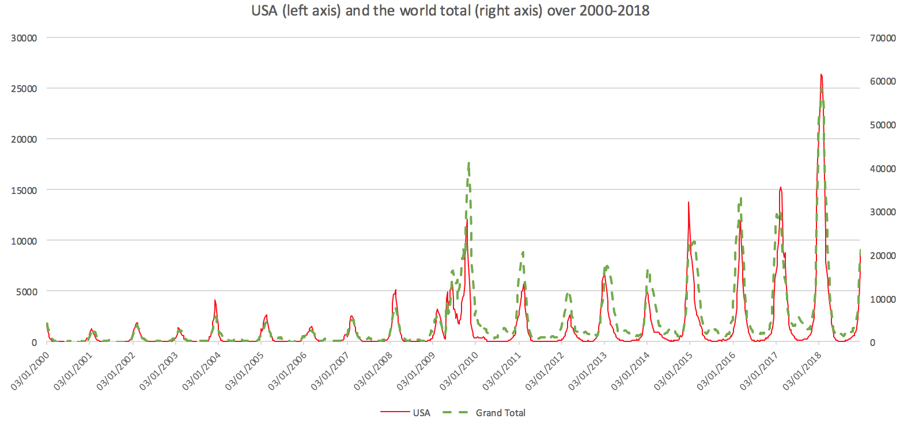

=================
Univariate ARIMA & VAR trials
=================

Motivation & Introduction
============

A usual method to approach a time series  :math:`(X_{t})_{t=1}^{T}` is to observe its ARIMA structure. By ARIMA(p,d,q), we refer to

.. math:: \Delta^d (X_{t}) = a+\sum_{j=1}^p \theta_j \Delta^d (X_{t-j}) +\sum_{j=1}^q  \psi_j \varepsilon_{t-j} + \varepsilon_t
with :math:`\varepsilon_t \sim iidN(0,\sigma^2)` as a usual distributional assumption.

We start by looking at univariate case, which `X_{t}\in\mathbb{R}`.

Univariate examples
============

USA
-----------

We pick a country which has small empty reports over 2000-2018 and sizable numbers so that spikes compared to usual observations can be seen clearly. USA seems to be a good choice, with time plot as follows:

Indeed, compared to the globe, despite some other countries like Australia have yearly spike time being different from American, America data still captures the global trend as well as spikes.

Now, write the sequence as :math:`(USA_{t})_{t=1}^{T}`, and let us firstly check the stationarity: we run a Dickey-Fluller test on the sequence, and obtained a p-value of 0.022; a Dicky-Fuller on :math:`\Delta USA_t` to be having a p-value of 0.013; and on :math:`\Delta \Delta USA_t` gets a p-value of 0.009. Hence, upon the choice of significance level, we can have the following conclusion:

- djkfl

- fdklxm

Germany (DEU)
-----------

VAR example: DEU and its neighbourhoods
============

