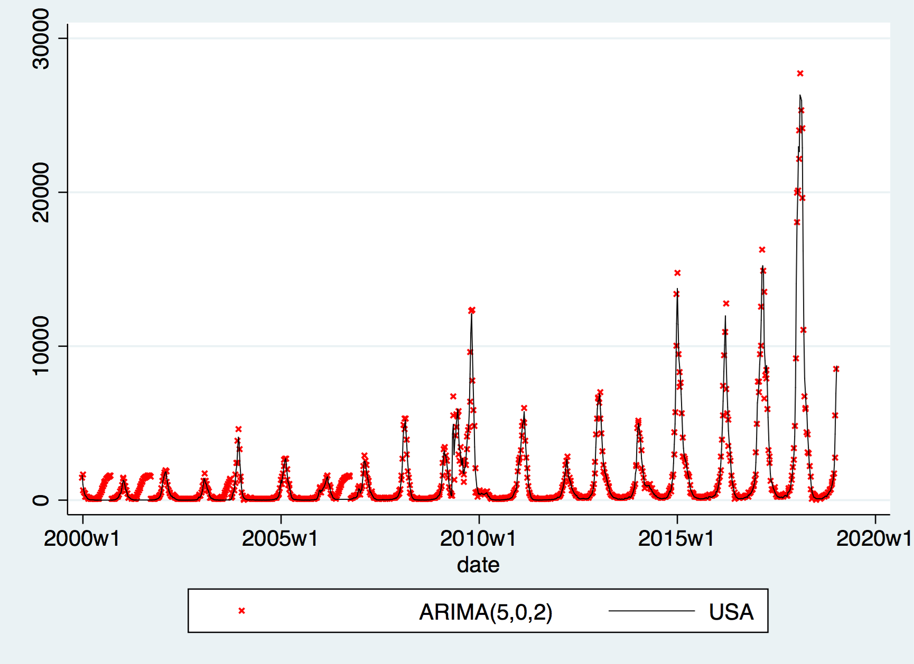

=================
Univariate ARIMA & VAR trials
=================

Motivation & Introduction
============

A usual method to approach a time series  :math:`(X_{t})_{t=1}^{T}` is to observe its ARIMA structure. By ARIMA(p,d,q), we refer to

.. math:: \Delta^d (X_{t}) = a+\sum_{j=1}^p \theta_j \Delta^d (X_{t-j}) +\sum_{j=1}^q  \psi_j \varepsilon_{t-j} + \varepsilon_t
with :math:`\varepsilon_t \sim iidN(0,\sigma^2)` as a usual distributional assumption.

We start by looking at univariate case, which `X_{t}\in\mathbb{R}`.

Univariate examples
============

USA
-----------

We pick a country which has small empty reports over 2000-2018 and sizable numbers so that spikes compared to usual observations can be seen clearly. USA seems to be a good choice, with time plot as follows:

.. image:: ./img/USA.png

Indeed, compared to the globe, despite some other countries like Australia have yearly spike time being different from American, America data still captures the global trend as well as spikes.

Now, write the sequence as :math:`(USA_{t})_{t=1}^{T}`, and let us firstly check the stationarity: we run a Dickey-Fluller test on the sequence, and obtained a p-value of 0.022; a Dicky-Fuller on :math:`\Delta USA_t` to be having a p-value of 0.013; and on :math:`\Delta \Delta USA_t` gets a p-value of 0.009. Hence, upon the choice of significance level, we can have the following conclusion:

- If we choose the significance level to be the classical 5% or anything above 2.3%, then we conclude :math:`USA_t \sim I(0)`, i.e. we can investigate :math:`USA_{t}` directly.

- If we choose the significance level to be a rigorous 1% for instance, then we conclude  :math:`USA_t \sim I(2)`, i.e. we can only investigate :math:`\Delta \Delta USA_{t}` directly.

For both circumstances, we can now carry on by reading the sample estimation on the ACF (Auto Correlation Function) and PACF (Partial Auto Correlation Function) to determine how many lags to use, i.e. we are now investigating :math:`USA_t \sim ARIMA(p, d, q)` where :math:`d \in \{0, 2\}`.

ARIMA(p,0,q)
~~~~~~~~
When d=0, i.e. using USAt we observed 1-2 significant lags in PACF and 1-9 in ACF, thus all 18 possible comibnations of ARIMA are ran, and based on Akaike Information Criterion (AIC) and the Bayesian Information Criterion (BIC), we selected the following two models for fitting:

- ARIMA(5,0,2), which has the lowest BIC and the second lowest AIC;

- ARIMA(7,0,2), which has the lowest AIC and the forth lowest BIC.

It turns out that the difference between these two models aren't huge --- the difference is within -350 to 300 interval throughout, and the plot is clearly similar as shown below:

.. image:: ./img/ARIMA702.png

ARIMA(p,2,q)
~~~~~~~~
Likewise, by observing the ACF and PACF, we found 1-4 significant lags in both ACF and PACF, thus run all 16 possible combinations of ARIMA, and select the following top two:

- ARIMA(1,2,4), which has the lowest BIC and the third lowest AIC;

- ARIMA(3,2,3), which has the second lowest BIC and the second lowest AIC.

The prediction, as shown below, are actually similar amongst the two. However, as one can see, perform poorly when facing spikes.

.. image:: ./img/ARIMA124.png

.. image:: ./img/ARIMA323.png

Germany (DEU)
-----------

VAR example: DEU and its neighbourhoods
============

