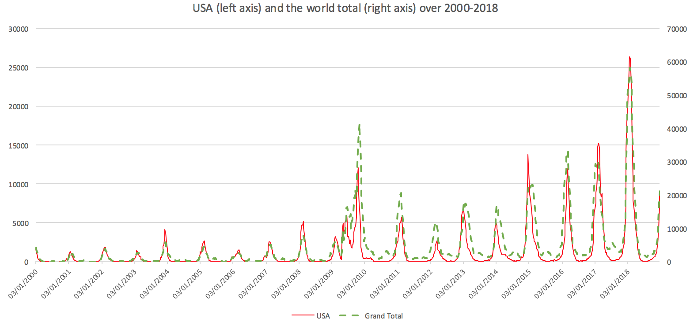
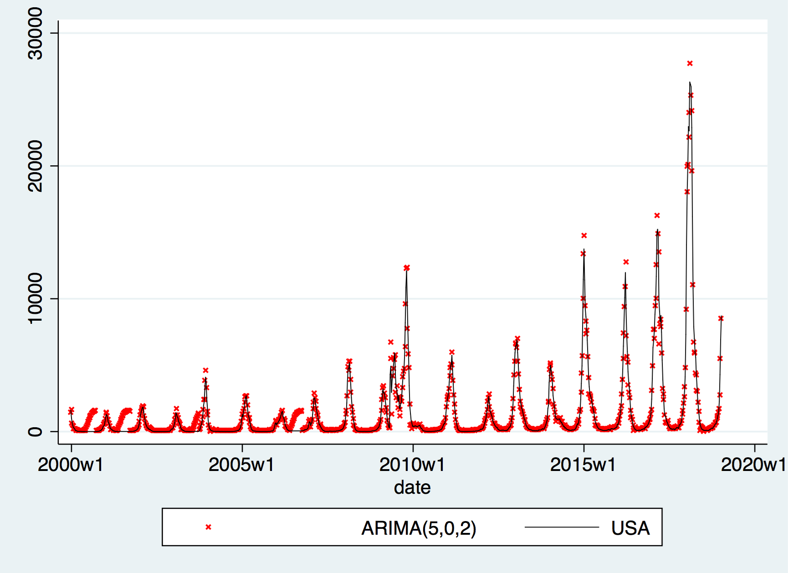
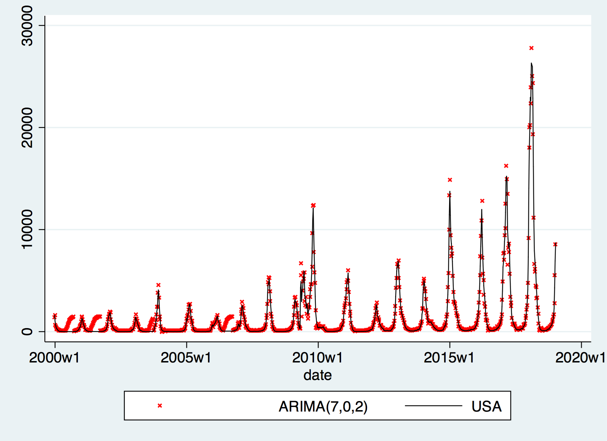
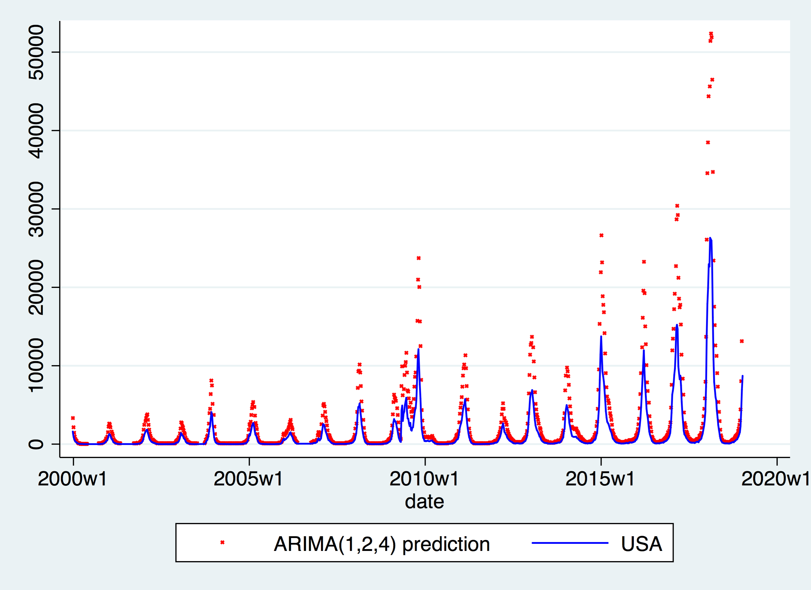
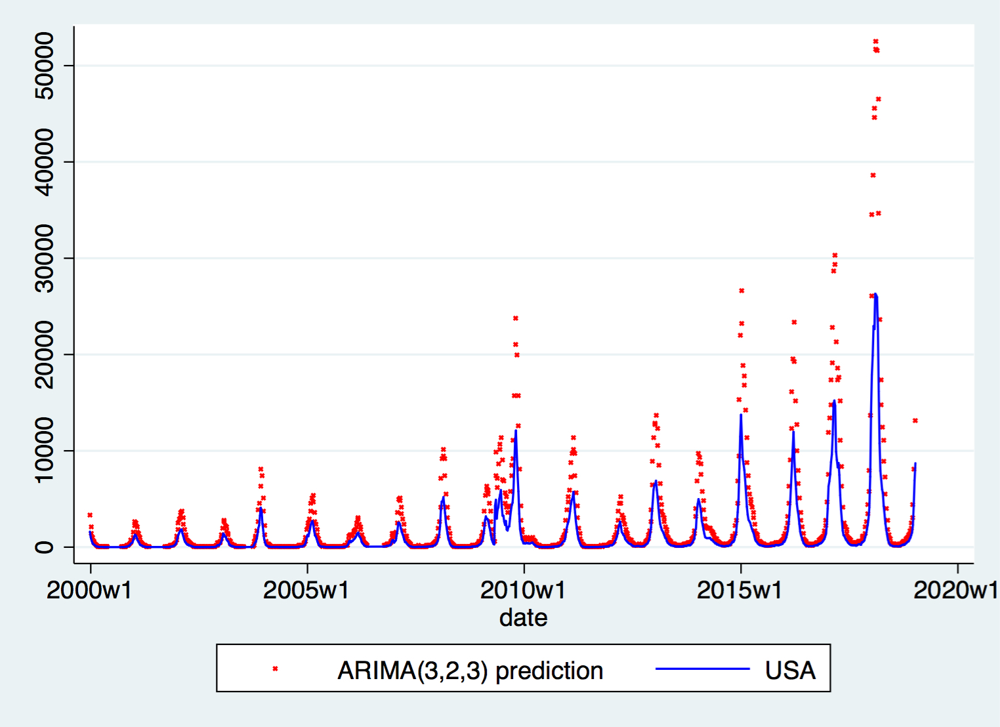
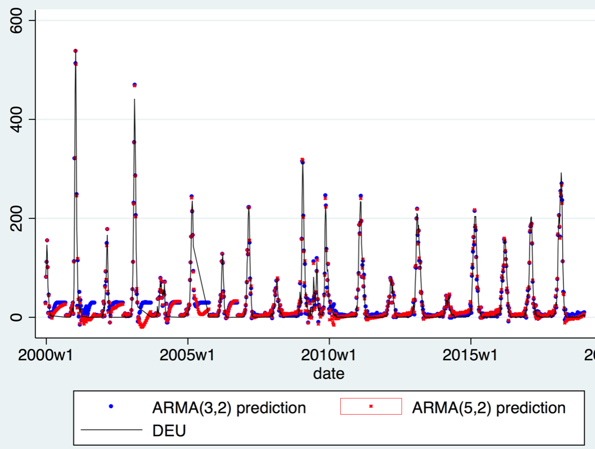
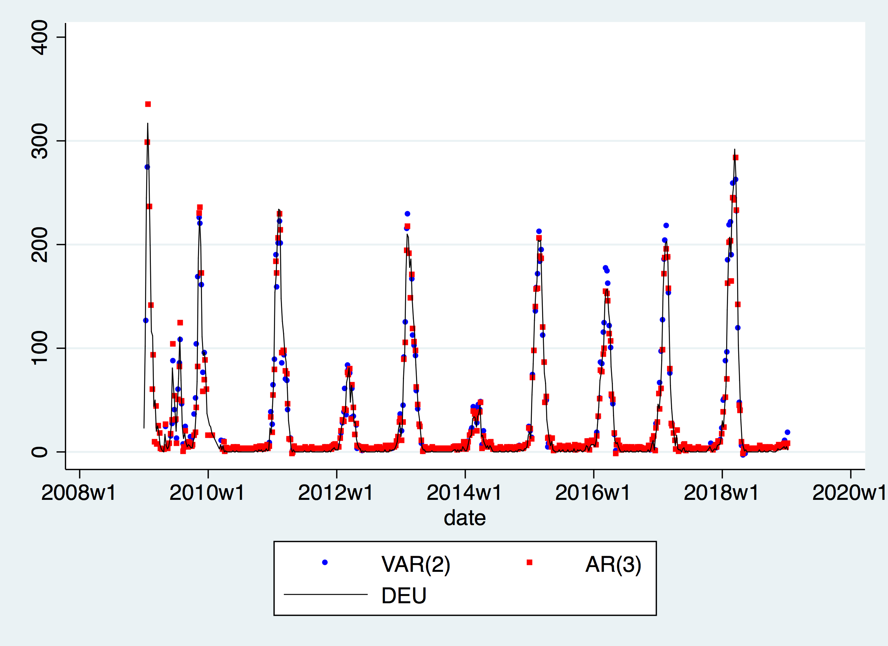
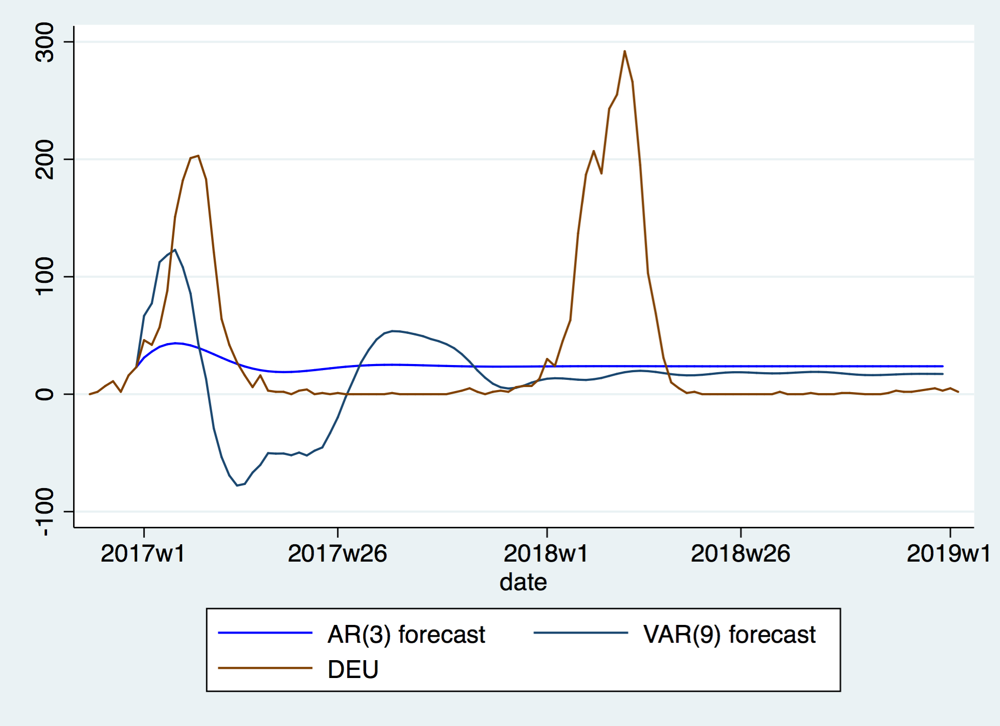

==================================
Univariate ARIMA & VAR trials
==================================

Motivation & Introduction
========================

A well-established method for modelling a time series  :math:`(X_{t})_{t=1}^{T}` is to observe its Autoregressive Integrated Moving Average (ARIMA) structure. :math:`ARIMA(p,d,q)` is defined as

.. math:: \Delta^d (X_{t}) = a+\sum_{j=1}^p \theta_j \Delta^d (X_{t-j}) +\sum_{j=1}^q  \psi_j \varepsilon_{t-j} + \varepsilon_t

where :math:`\varepsilon_t` is commonly assumed to be of form :math:`iidN(0,\sigma^2)`. :math:`\Delta^d` is an operator that takes the :math:`d`th degree difference, :math:`p` is the order of the autoregressive model, and :math:`q` is the order of the moving-average model.

We start by looking at univariate case, where :math:`X_{t}\in\mathbb{R}`.

Univariate examples
========================

USA
-----------

We pick a country which has few empty reports over 2000-2018 and a large variation in numbers so that the peaks can be easily distinguished from the background rate. USA seems to be a good choice, and the time series is as follows:

Compared to the global trend, despite some countries in the Southern Hemisphere (e.g Australia) having flu season 6 months away from the American one, the American data still captures the global trend remarkably well.

Define the sequence as :math:`(USA_{t})_{t=1}^{T}`. We first check its stationarity. We conduct a Dickey-Fluller test on the sequence, and obtain a p-value of 0.022; a Dicky-Fuller on :math:`\Delta USA_t` a p-value of 0.013; and on :math:`\Delta \Delta USA_t` a p-value of 0.009. From this data, we can reach the following conclusions:

- If we choose the significance level to be the typical 5% or indeed, anything above 2.3%, then we conclude :math:`USA_t \sim I(0)`, i.e. we can investigate :math:`USA_{t}` directly.

- If we choose the significance level to be a more rigorous 1%, then we conclude  :math:`USA_t \sim I(2)`, i.e. we can only investigate :math:`\Delta \Delta USA_{t}` directly.

For both circumstances, we carry on by reading the sample estimation on the ACF (Auto Correlation Function) and PACF (Partial Auto Correlation Function) to determine how many lags to use, i.e. we are now investigating :math:`USA_t \sim ARIMA(p, d, q)` where :math:`d \in \{0, 2\}`.

ARIMA(p,0,q)
~~~~~~~~~~~~~~~~
When d=0, i.e. using :math:`USA_t` we observe 1-2 significant lags in PACF and 1-9 in ACF. All 18 possible comibnations of ARIMA are ran, and based on the Akaike Information Criterion (AIC) and the Bayesian Information Criterion (BIC), we selected the following two models for fitting:

- ARIMA(5,0,2), which has the lowest BIC and the second lowest AIC;

- ARIMA(7,0,2), which has the lowest AIC and the forth lowest BIC.

It turns out that the difference between these two models isn't huge --- the difference is within -350 to 300 interval throughout, and the plot is clearly similar as shown below:

ARIMA(p,2,q)
~~~~~~~~~~~~~~~~
Likewise, by observing the ACF and PACF, we found 1-4 significant lags in both ACF and PACF. We run all 16 possible combinations of ARIMA, and select the following top two best performing ones:

- ARIMA(1,2,4), which has the lowest BIC and the third lowest AIC;

- ARIMA(3,2,3), which has the second lowest BIC and the second lowest AIC.

The predictions, as shown below, are actually similar amongst the two. However, they both perform poorly when facing spikes.

Comparing models
~~~~~~~~~~~~~~~~~~~~~~~~

In terms of information criterion, the two :math:`ARIMA(p,2,q)` models have slightly lower information criteria for both AIC and BIC amongst the four. However, they are all quite similar, lying within 2% of each other.

However, in terms of Mean Sum of Squared Errors (MSE), :math:`ARIMA(p,2,q)` models perform much worse; 40-50 times larger than :math:`ARIMA(p,0,q)`s, which could be understood as the :math:`ARIMA(p,2,q)` models failing to predict precise large movements when there are spikes in the data.

Germany
-----------
As an interest of this report in general, we also look at data for Germany.

Germany's data is not as clean as the American one in that it has more empty slots than the American data, which results in a less complete time series to run ARIMA fittings on.

We repeat the previous procedure, starting with the Dickey Fuller stationarity test, which gives a p-value of 0 up to the 5th significant level. Therefore we fit a :math:`ARIMA(p,0,q)` model for :math:`DEU_t`, the time series data for Germany.

By getting 1-5 significant lags via sample ACF and 1-2 significant lags via sample PACF, we get 10 possible combinations, and similar to the previous case, the top two are:

- ARIMA(5,0,2), which has the lowest BIC and the lowest AIC;
- ARIMA(3,0,2), which has the second lowest BIC and the third lowest AIC.

As shown below, in this case peaks are nicely captured.

VAR example: Germany and its neighbourhoods
===================================================

The concept of Vector Autoregression (VAR) is simply an :math:`ARIMA(p,0,0)` model with :math:`X_{t}\in\mathbb{R}^n` where :math:`n\geq 2`, i.e. the variable, is now a proper vector, rather than a scalar.

This framework begs the question of which variables one should pick. As analysed above, Germany should be an obvious country to investigate. Germany's surrounding countries, which also have recorded a significant amount of data, are also included, allowing the transmission of influenza to be understood in a broader manner.

As a matter of geographical fact, (note: see the `datasets section <datasets.html>`_ and the below map for further details) Germany borders Denmark (DNK), Netherlands (NLD), Belgium (BEL), Luxembourg (LUX), France (FRA), Switzerland (CHE), Austria (AUT), Czech Republic (CZE), and Poland (POL).

.. raw:: html

	<iframe src="../_static/p_break.html" height="500px" width="110%"></iframe>
`Figure link <https://public.tableau.com/profile/harrison4446#!/vizhome/influenza_15538744094150/Spatialoutbreak>`_.

Investigating each individual country, we find that the Netherlands, Denmark, Poland, and the Czech Republic have no significant data before 2009, Luxembourg has no data before 2003, Austria has no data before 2011, and France has no data before 2013. To run the VAR smoothly, we drop France and Austria, and only consider years after 2008. Additionally, the Czech Republic has numerous empty observations throughout, which would make the VAR restricted due to a smaller sample size, so their data is discarded as well.

We now consider the remaining 8 countries together, use their data as our input.

Due to data availability, the maximum value of :math:`p` that could be used  was 8. Hence run all  :math:`p \in \{0,1,...,8\}` and find the one with the least Schwarz Bayesian Information Criterion (SBIC). We find  :math:`p =2` to be optimal.

In order to compare whether the VAR fits our model well, we consider a univariate AR(p) model for Germany and see whether fitting a VAR with a wider dataset improves our performance. We run all possible p up to 52, and by BIC, found :math:`p =3` to be optimal. The two models' fitting results as follows:

MSE counter-intuitively suggests the baseline AR(3) model to be 20% better than the more complex VAR(2) model. This can be observed in the above graph, where VAR predictions seem to be overshooting during outbreaks. It is difficult to explain this phenomenon fully, but it could be that the German data is *so good* that adding in  neighbouring countries' data effectively adds noise. Another factor could be that Germany is much larger than its neighbours, especially once we discard French data, making foreign influence on Germany relatively insignificant, and adding them may just may amount to adding noise.

VAR extension to forecasting: Germany
===================================================

We also want to see how traditional time series models perform in terms of training-styled forecasting. To do so, we consider the 2013-2016 dataset for training, and 2017-2018 for predicting. The purpose of further restricting the dataset is to allow us to use Austrian and French data, which may make foreign neighbours' influence more helpful, which may solve the issue that was concerned in the previous section.

As a exploratory note, we see Belgium has a zero median, which means more than half of the non-empty entries are zero, so we believe the data for Belgium should be discarded, as otherwise a collinearity/data-hunger issue may be faced. The Czech Republic has only 111 observations throughout 2013-2016, so we discard it yet again.

We also realised that, even by dropping these two countries, there is a large amount of missing data, and effective observations of the entire vector becomes scarcer than required, which reduces the availability of VAR(p) regressions. We are therefore justified in filling the empty entries by zero: those countries that didn't opt to report for a few weeks most likely had nothing to report. This may cause trouble if the dataset of interest were in the 2000s period, when countries purely did not opt to report independent of any number-related facts. In 2013-16 however, missing entries occur at the time when no major outbreak occurred and usually before and after zero or small number of reports being made. Hence such filling should not distort the nature of the data, whilst benefit largely to the subsequent modelling.

After the above operations, we find that :math:`p \in \{0,1,...,20\}` are the technically feasible set of lags, and thus perform regession on it to obtain the SBIC. We found VAR(9) to have the best performance, which gets an MSE of 5927. Using the same procedure, we also run all AR(p) up to 80, after which BIC suggests AR(3) to be the best fit out of the univariate models. Surprisingly, that univariate model yields a MSE=4968.

We may be able to explain this surprising result with the following plot:

While none of them are any good, VAR(9) performs much worse than AR(3) by predicting non-physical values of less than 0.

All above trials have shown how traditional time series can barely fit the data, despite using advanced procedures for model selection, and using more solid, complete, and continuous series from our dataset.

