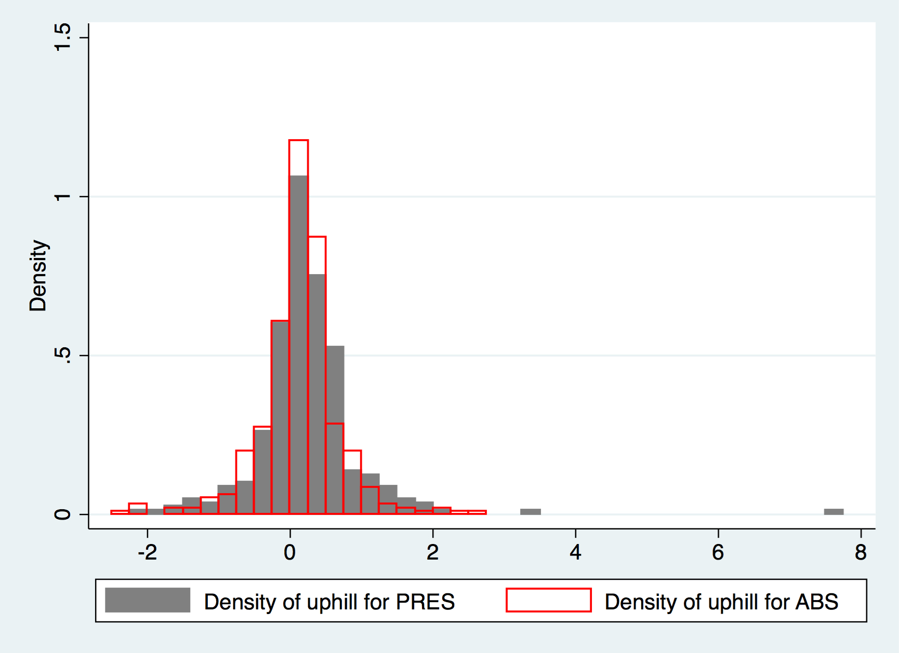
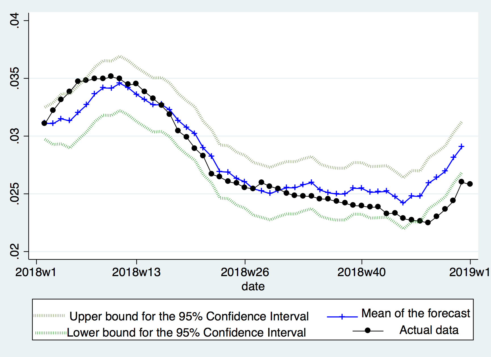

=================
Presenteeism
=================

Motivation & Introduction
======

The current models we have do not take into account social factors, and we believed we may be able to create an effective model by incorporating this data. We hypothesised that we may be able to explain which regions are more severely affected by influenza by looking at variables that we haven't investigated yet that may increase the 'risk factor' of a nation to staying in a state of high influenza infection rates.

We first collect a number of variables, both social and physical, as described in :ref:`the datasets section <datasets>` and :ref:`the additional datasets section <additional_datasets>`. We then construct a simple elastic net model [#elasticnet]_ , i.e. we minimise the objective function

.. math::

    \min_{w} { \frac{1}{2n_{samples}} ||X w - y||_2 ^ 2 + \alpha \rho ||w||_1 + \frac{\alpha(1-\rho)}{2} ||w||_2 ^ 2}

to perform variable selection. This model has a set of coefficients that represent the way that each variable correlates with the output. To ensure that we could properly see which variables were most significant, we normalise all the input features to be between 0 and 1. We train the model on developed countries to control for underdeveloped countries having other unaccounted factors that will skew our results. We observe the following coefficients as a result of running this process::

    Minimum temperature :  -35.75207412089624
    Maximum temperature :  -27.572710323493112
    Precipitation :  -1.1936198807223342
    Climate water deficit :  0.9117976671368961
    Actual evapotranspiration :  -25.67468313304453
    Downward surface shortwave radiation :  -15.056164498685526
    Vapour pressure :  -8.59360337613683
    Hours worked per year :  48.18539588156608
    Total healthcare expenditure per capita, adjusted by PPP :  21.214423216995893
    Number of physicians per capita :  -36.074258171081844

As we know and expect, the higher the temperature, the fewer the positive instances of influenza [#temperatureflu]_. What is surprising is the high positive coefficient for the hours worked per year. While some degree of correlation was expected, the extremely large coefficient, significantly larger than any other known factor, motivated us to create a model using this as a explanatory factor.

We believe that a potential explanation for this is the effect of presenteeism culture. So-called presenteeism, when ill workers come into work due to societal pressure and spread disease, can contribute to the spread of disease, with a study estimating that presenteeism costing the U.S. economy a staggering $150 billion a year [#presenteeism]_, and we can reasonably assume that the number of hours worked per year correlates with presenteeism culture.

Methodology & Construction
=====

We obtain the working hour of dependent work data from OECD dataset during 2000-2017, and as is aimed by the report, the focus is restricted to the Europe region outlined by WHO. Amongst the 24 countries who reported, a yearly average is calculated, above which gets allocated to the group PRES (Presenteeism), and the rest to the group ABS (Absenteeism). There are 10 countries which stays in ABS throughout 2000-2017, 10 countries in PRES throughout, and the remaining 4 has switched for at least once. Those 4 are ruled out of the dataset for simplicity. Full breakdown can be seen in the below map.

.. image:: ../img/pmap2.png

For each country, we calculate its percentage weekly change if the observation is non-zero or empty. In case of zero or empty, we assume the weekly change to be zero. (See `Univariate ARIMA & VAR trials <ARIMA_&_VAR.html>`_ for further explanations.) Then, compute, for each group, the arithmatic average of the percentage change across time. Therefore we now get two series :math:`\{PRES_t\}_{t=1}^{990}` and :math:`\{ABS_t\}_{t=1}^{990}` measuring average percentage change (weekly) across countries within each group.

What drives us the interest is the speed of going up or down in terms of the outbreak. More mathematically, it is the change in the percentage change that is being important. Moreover, uphill may have different performance compared to downhill, given the rich weekly dataset being available, we proceed by dividing the uphill part and downhill part, as well as make the change in the percentage change:

.. math:: \forall x \in \{ABS,PRES\}, \\ \text{define  } \hspace{1cm} {uphill}_{x,t}:= \mathbb{1}[x_t>0]\Delta x_t \\  \hspace{2cm} {downhill}_{x,t}:= \mathbb{1}[x_t\leq 0]\Delta x_t

Now, we run some interesting statistical tests to see if factually the speed of changes in infection could be different across these two groups. 

Descriptive Statistical Tests
==========

Test against the following hypothesis: 

.. math:: H_0: \mathbb{E}[{uphill}_{PRES,t}] = \mathbb{E}[{uphill}_{ABS,t}] 

.. math:: H_A: \mathbb{E}[{uphill}_{PRES,t}] \neq \mathbb{E}[{uphill}_{ABS,t}] 

By constructing the mean statistic :math:`\overline{{uphill}_{PRES,t}-{uphill}_{ABS,t}} `, we get a t-statistic of 1.23, associated with a p-value of 0.22, which means we can not reject the :math:`H_0` ,despite the uphill speed for 
PRES seems to be slightly quicker than the ABS one.

The histogram confirms such slight trend, where PRES has slightly more rightward weight than left.

Compared to a standard normal distribution where Skewness is zero and Kurtosis is three, :math:`{uphill}_{PRES,t}` has a fairly positive skewness of 3.16 and kurtosis of 34.2, whilst for the ABS one, the skewness is only -0.192 and kurtosis being 7.42. The above reflects further that PRES has more uphill momentum than ABS, despite statistical conclusion can not be drawn rigorously. 

Likewise, when testing against the following hypothesis:

.. math:: H_0: \mathbb{E}[{downhill}_{PRES,t}] = \mathbb{E}[{downhill}_{ABS,t}] 

.. math:: H_A: \mathbb{E}[{downhill}_{PRES,t}] \neq \mathbb{E}[{downhill}_{ABS,t}] 

With the mean statistic :math:`\overline{{uphill}_{PRES,t}-{uphill}_{ABS,t}} `, we get a t-statistic of 0.21, associated with a p-value of 0.83, which means we definitely can not reject the :math:`H_0`. In fact, we could conclude that the downhill speed for ABS is quite similar to the PRES one.

As a conclusive remark, we may thus say that PRES may have a quicker acceleration than ABS in terms of infection transmission, but not the curing part. However, for the statistical rigour, nothing could be concluded apart from they are similar, at 5% significance level.

Time Series
========

We start by asking a slightly "upgraded" question, which, knowing classical time series doesn't work --- would massive AR models by of good? This question is also motivated by the fact that Kalman filters could theoretically be more useful, in terms of fitness, compared to classical time series methods.

After a few trials, the following model is presented. We drop all observations before March 2014 for the purpose of higher quality data, and put aside year 2018 for assessment. A 3-year-long AR filter is then applied to the accumulated :math:`PRES_t` , using Time Series language, a big AR(156) model is fitted. The result, as shown below, is quite a good one, where the forecast meats the actual data  quite well, and rarely did the actual data go out of the 95% Confidence Interval.

.. [#elasticnet] https://citeseerx.ist.psu.edu/viewdoc/summary?doi=10.1.1.124.4696
.. [#temperatureflu] https://jvi.asm.org/content/88/14/7692s
.. [#presenteeism] https://www.forbes.com/sites/karenhigginbottom/2018/04/20/the-price-of-presenteeism-2/#4742f0f37f9c
