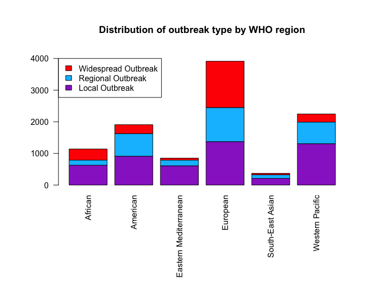
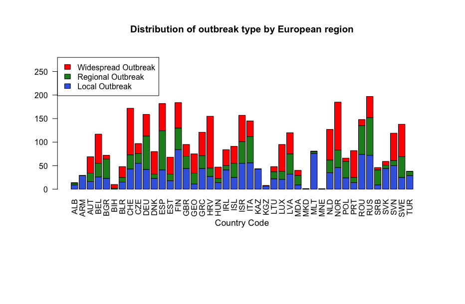
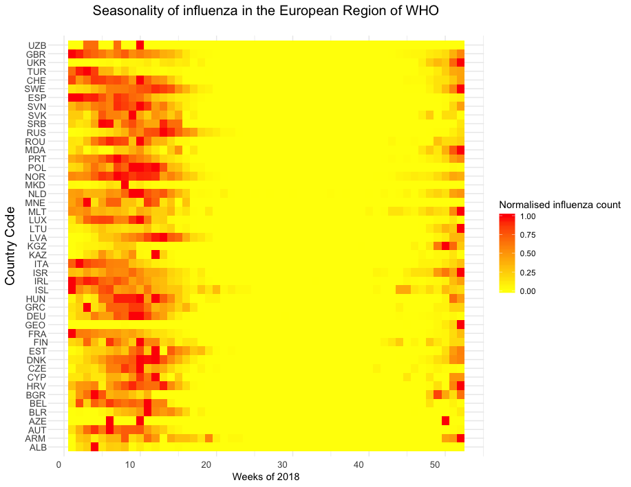
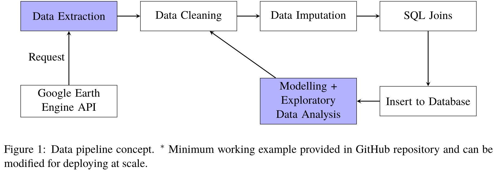

.. _datasets:

=================
Datasets
=================

While most of the data we required was provided and already in a fairly structured form, we had to take care to process data to account for missing data, at times interpolating between data points. This section will outline the procedures undertaken to obtain/clean the data for each dataset used. Missing data in general was marked as :code:`N/A` and the time steps where such data occurred were disregarded during modelling.

Influenza Data
--------------

As the project was focussed on the spread of influenza, the logical choice was to use the WHO FluNet database provided in the :code:`influenza_activity` dataset. As the different types of influenza have similar levels of symptoms, we decided that the field of most interest was the number of total detected influenza viruses as opposed to the data for each subtype of influenza. This also had the advantage of giving us more data to work with; many countries recorded total influenza activity while not necessarily recording data for each type of influenza.

The dataset was relatively clean and did not require extensive processing. Missing influenza counts, accounting for 0.06% of the all count records, were imputed by the mean. To create predictive models, a large number of other datasets were also created and joined with this cleaned dataset using the :code:`country_code` as the primary key.

The dataset was used as-is but a version was also made where the data was collected such that it was at a monthly timescale as opposed to a weekly one, due to many of the other variables having a monthly or yearly timescale.

Below we consider the distribution of outbreak type for each WHO region. We find that the European region has the highest recorded level. While it is not possible to comment on whether this is due to better reporting standards in Europe, population size, or greater susceptibility to outbreak, this visualisation motivates a European focus due to increased size. 

In contrast to the above, a similar visualisation of outbreak type in European countries does not yield a large number of observations in any particular country. The smallest number of total outbreaks were observed in the Republic of Macedonia and Montenegro with respectively 1 Regional Outbreak and 1 Widespread Outbreak. The largest number of outbreaks was recorded at 197 in Russia.

By observing the seasonality of influenza cycles we are able to understand whether or not it is justified to aggregate European data for modelling purposes. The below graphic depicts the influenza cycles within the WHOs European region, each normalised by their maximum weekly count. A distinct influenza season is observed approximately between week 45 (Nov) to week 19 (Apr). This seasonal property leads us to question how climatological features play a role in the spread of influenza. We consider such data in the following section. This observation also justifies the decision to model European wide influenza cycles in our :ref:`Bayesian approach <bayesian>`.

Remote Sensing Data
-------------------

Influenza viruses can survive much longer at low humidity and low temperatures, partially contributing to the seasonality of flu outbreaks [#flutemp]_.

We obtained the coordinates of the capitals of each country and performed an SQL left join of ``influenza`` on
the coordinates. We picked the coordinates of the capitals because these would usually indicate the regions with
most of the population. We can make the following observations.

- Influenza outbreaks seems to appear in clusters of regions. Especially for Europe and Central + South America. One of our goals could be to identify how the spread occurs over space and time.

**To use the dragging cursor**, click on the play icon and select the second icon.

.. raw:: html

	<iframe src="_static/spatial_outbreak.html" height="530px" width="100%"></iframe>
`Figure link <https://public.tableau.com/profile/harrison4446#!/vizhome/outbreak_influenza/Spatialoutbreak/>`_. Our previous visualisation and studies view that there is a yearly seasonality. Many recent studies have been
on studying the relationship of spatiotemporal spread of influenza and diseases over a particular regional clusters.
For example, Bhatt et al., 2017 [#bhatt]_ looked at mapping disease over space-time using a GP in sub-Saharan Africa,
Chen et al., 2019 [#chen]_ looked at seasonal influenza spread in Shenzhen, China and Senanayake et al., 2016 [#senanayake]_ on weekly flu
occurrence in the USA.

Motivated by Bhatt et al., 2017 [#bhatt]_, we use live satellite imagery (NOOA, TerraClimate)
to obtain aggregated remote sensing data of temperature, precipitation,
humidity etc... to augment our existing feature space. The data can be found from
Google Earth Engine API [#gorelick]_ newly-developed by Google. An extraction pipeline is illustrated below.

The extraction procedure is complicated, as all the computations for extracting the final ``csv`` is done in the Google Cloud Server, which has specific data structures for everything, through requests using the Python API. The satellite images are stored in the ``ImageCollection`` data structure as a collection of images. We first obtain the ``ImageCollection``, select the range of dates we are interested in and then reduce the collection to a single image by taking the mean of all the features and pixels. We then obtain the coordinates of every country through a nations ``FeatureCollection``, perform a mean ``reduction`` over 4000x4000m squares over each country to obtain the average feature values of each country during the specified range of dates. Finally, we make a request to export to a single ``csv`` and save it into Google Drive.

For our study, we extract monthly and weekly remote sensing data from NOAA and TerraClimate respectively [#gorelick]_. We then merge all the monthly or weekly data together and then perform SQL joins with the coordinates of the capitals of each country and the ``influenza_activity.csv`` dataset.

Using Lasso regularised regression and ElasticNet, we select the following features for use in spatiotemporal modelling later on:

- Capital city latitude
- Capital city longitude
- Temperature
- Evapotranspiration, derived using a one-dimensional soil water balance model
- Surface pressure
- Surface Height
- Year
- Week

.. [#flutemp] http://sitn.hms.harvard.edu/flash/2014/the-reason-for-the-season-why-flu-strikes-in-winter/

.. [#chen] Chen, S., Xu, J., Wu, Y., Wang, X., Fang, S., Cheng, J., Liu, X. 2019. Predicting temporal propagation of seasonal influenza using improved gaussian process model. Journal of Biomedical Informatics, 93, 103144. https://doi.org/https://doi.org/10.1016/j.jbi.2019.103144

.. [#bhatt] Bhatt, S., Cameron, E., Flaxman, S.R., Weiss, D.J., Smith, D.L. and Gething, P.W., 2017. Improved prediction accuracy for disease risk mapping using Gaussian process stacked generalization. Journal of The Royal Society Interface, 14(134), p.20170520.

.. [#gorelick] N.Gorelick, M. Hancher, M. Dixon, S. Ilyushchenko, D. Thau, and R. Moore.  Google earth engine:Planetary-scale geospatial analysis for everyone. Remote Sensing of Environment, 2017. doi: 10.1016/j.rse.2017.06.031. URLhttps://doi.org/10.1016/j.rse.2017.06.031.

.. [#senanayake] Ransalu Senanayake, Simon O'Callaghan, and Fabio Ramos. 2016. Predicting spatio–temporal propagation of seasonal influenza using variational Gaussian process regression. In Proceedings of the Thirtieth AAAI Conference on Artificial Intelligence (AAAI'16). AAAI Press 3901-3907.
