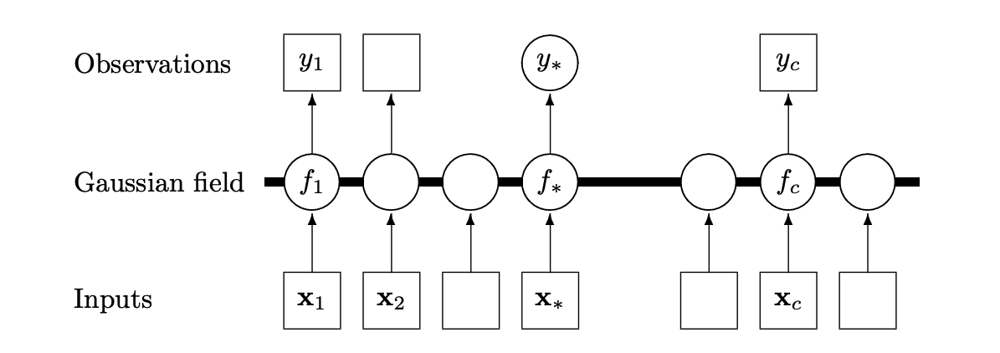
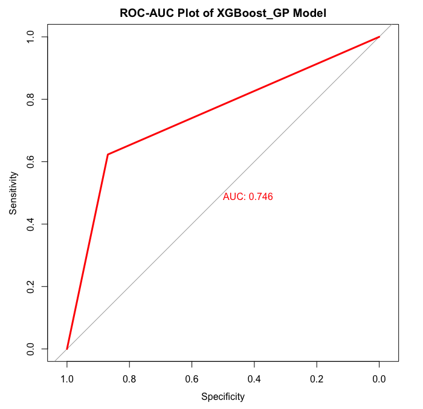

Spatiotemporal Modelling
========================

Motivation
----------

For policy makers, it would be a paramount importance to understand when and where outbreaks of influenza will occur: allowing for suitable allocation of resources for disaster prevention and planning. The study of the spatiotemporal and geographical factors to disease outbreaks have only recently become a source of research interest (Bhatt et al., 2017; Chen et al, 2019).

**In this contribution**, we propose 3 classes of models: Gaussian process regression, Deep Gaussian processes and, to the best of our knowledge, a new Gaussian process mixture with XGBoost mean function model to provide a surveillance model for influenza outbreaks.

Suppose :math:`\{X_i,y_i\}_{i=1}^N` as our features and response (number of positive influenza cases). We
will assume the following underlying relationship:

.. math::

   y_i = f(x_i) + \epsilon_i,

where :math:`x_i\in\mathbb{R}^p` is the feature, :math:`\epsilon_i\sim N(0,\sigma^2)` 
and :math:`f`
is the underlying function. Since :math:`x_i` contains spatial and temporal features, 
the standard regression methods
of generalised additive models (GAMs) (Davison, 2003), gradient boosting and regression
trees (Bishop, 2006) are not adapted to this problem, and does not help us 
understand the underlying causality/correlation. In addition, pure time series
models such as Long-short term memory (LSTM) recurrent neural networks (Hochreiter et al., 1997),
SARIMA and ARMA-GARCH models (Davison, 2003) also do not take in account of the spatial
variation. On the other hand, stochastic processes such as Gaussian processes (GP) (Rasmussen et al., 2006)
or solutions to stochastic partial differential equations (SPDE) (Hairer, 2009) are
well-adapted to what we would like to accomplish.

Influenza outbreaks often contain complicated causal relationships between many different social, geographical and political factors. SPDEs are the most natural approach to modelling spatiotemporal
phenomenon, by adding a driven white noise to a partial differential
equation (PDE) to obtain

.. math::

   Lu = f + \xi\circ dW,

where :math:`L` is a differential operator, :math:`f` is a function and :math:`\xi\circ dW`
is a driven white noise. However, there is limited software to provide
solutions to these SPDEs. ``R-INLA`` (Lindgren et al., 2015) is a library that uses the Bayesian
method integrated nested Laplace approximation (INLA) to construct weak
solutions to linear fractional SPDEs, but this places too much
restriction of the underlying SPDE and would result in black-box
modelling. 

Gaussian Processes Review
--------------------------

In this study, we will thus use GPs as a spatiotemporal framework to
study spatiotemporal variations. We let :math:`f` have a Gaussian process prior, giving

.. math::

   f\sim GP(\mu(\cdot), k(\cdot,\cdot)),

where :math:`\mu(\cdot):= E[f(\cdot)]` and :math:`k(\cdot,\cdot):= E[f(\cdot), f(\cdot)]` are 
chosen mean and covariance functions. 
We also call :math:`k(\cdot,\cdot)` a kernel by convention. The choice of the mean is usually zero mean,
constant mean, polynomial or splines. This helps us capture the trend of :math:`y_i`. However, perhaps 
what would be more important is capturing the covariance between different features. It is 
worth mentioning that GP regression is a form of non-parametric (infinite-dimensional) regression.
Suppose we have observed some data :math:`X,y` with :math:`N` observation and we are given a 
test set :math:`X_*` with :math:`K` observations,  where we would like to predict :math:`y_*`. 
Then using the  Sherman-Morrison-Woodbury identity on the joint posterior of the GP, 
we obtain the posterior predictive distribution of :math:`f_*` (Rasmussen et al, 2006)

.. math::

    f_*| X,y,f\sim N_K(K_*(K + \sigma^2I_N)^{-1}[f + \mu], K_{**} - K_*(K + \sigma^2I_N)^{-1}K_*^T),

where the notations are :math:`f, f_*` denote the value of the function for the training and test set,
for the GP function, :math:`K, K_*,K_{**}` are the covariance matrices of the training, test-training and
test sets, and :math:`\mu` is taken to be the short hand for the mean of the training set. In addition, 
standard results from decision theory (Rasmussen et al., 2006) show that taking the loss
function as the expected square error gives the optimal prediction as 

.. math::

    E[f_*| X,y,f] = K_*(K + \sigma^2I_N)^{-1}[f + \mu].

Another way to understand Gaussian processes would be that 
we have a graphical model of :math:`p` dimensions (:math:`p` types of inputs). Below is a 
1-dimensional example visualisation of a Gaussian process random field.

Finally, we will also use a Gaussian process classification model, but the theory is more complicated, requiring variation inference, and we will omit the details. We similarly state the result that the optimal predictor for a classification problem with the 0-1 loss is the Bayes's classifier.

The data
--------

Below is a spatiotemporal exploratory analysis of the number of influenza cases from the ``influenza`` dataset. 
We obtained the coordinates of the capitals of each country and performed an SQL left join of ``influenza`` on
the coordinates. We picked the coordinates of the capitals because these would usually indicate the regions with
most of the population.

To use the dragging cursor, click on the play icon and select the second icon.

We can make the following observations.

- Influenza outbreaks seems to appear in clusters of regions. Especially for Europe and Central + South America.
One of our goals could be to identity how the spread occurs over space and time.
- There are more outbreak reports in Europe and fewer in South America. This may be due to better surveying and medical
infrastructure in Europe. Another subject of study for us would be to use the existing data for 
South America to interpolate what could happen in countries where there is little or no observation, 
using a spatiotemporal model.

.. raw:: html

	<iframe src="_static/spatial_outbreak.html" height="530px" width="100%"></iframe>

Our previous visualisation and studies view that there is a yearly seasonality. Many recent studies have been 
on studying the relationship of spatiotemporal spread of influenza and diseases over a particular regional clusters. 
For example, Bhatt et al., 2017 looked at mapping disease over space-time using a GP in sub-Saharan Africa, 
Chen et al, 2019 looked at seasonal influenza spread in Shenzhen, China and Senanayake et al., 2016 on weekly flu
occurrence in the USA. 

Motivated by Bhatt et al., 2017, we use live satellite imagery (NOOA, MODIS, TERRACLIMATE) 
to obtain aggregated remote sensing data of temperature, precipitation, 
humidity etc... to augment our existing feature space. The data can be found from 
Google Earth Engine API (Gorelick et al., 2017) newly-developed by Google. An extraction pipeline is illustrated below.

.. image:: ./img/ee_pipeline.png

Using Lasso regularised regression, we select the following features for our Gaussian process model

- Capital city latitude 
- Capital city longitude 
- Weekly temperature 
- Evapotranspiration, derived using a one-dimensional soil water balance model 
- Surface pressure
- Surface Height
- Year 
- Month

In particular, we found that spatial, temporal and the number of physicians to be highly 
significant features to the occurrence of influenza. Of course, as GPs are nonparametric models,
keeping these variables will not have a bad effect on the model fit as GPs are able to fit sufficiently
regular underlying functions (see http://www.stats.ox.ac.uk/~sejdinov/teaching/atml14/Theory_2014.pdf for a 
rigorous treatment of reproducing kernel Hilbert spaces for Gaussian processes).

Model 1: Gaussian process
-------------------------

To treat the seasonal effects, we will choose a kernel 

.. math::
	
	k_{\text{se}}(t', t) =  \exp\Bigg(\frac{2\sin^2(\pi||t-t'||_1 f)}{l^2} \Bigg)

for years :math:`t,t'`, where :math:`f,l'` are the kernel frequency and length scale. We encode a prior distribution
for the frequency to favour the value 1, as we believe that influenza outbreak occurs seasonally during winter.

The weekly effects, through our exploratory data analysis, reviews a relatively smooth trend and so we use. a
radial basis kernel:

.. math::
	
	k_{\text{se}}(x', x) =  \exp\Bigg(-\frac{(x_1-x_2)^T(x_1-x_2)}{l} \Bigg),

where :math:`l` is the length scale. The theory of reproducing
Hilbert kernel spaces (see http://www.stats.ox.ac.uk/~sejdinov/teaching/atml14/Theory_2014.pdf) justifies our
claim, since if the underlying functional relationship of the weekly effect is sufficiently regular (Holder-Sobolev of
certain exponents), then we are able to estimate it well with a GP. 

For the spatial and remote sensing features, we use Matérn covariance kernels each respectively. This is defined as

.. math::
	
	k_{\text{se}}(x', x) =  \frac{2^{1-\nu}}{\Gamma(\nu)}(\sqrt{2\nu}d)K_\nu(\sqrt{2\nu}d),

where :math:`K_\nu,v'` are the modified Bessel function and smoothness parameter, and :math:`d=||x_1-x_2||_\Theta'`,
with :math:`\Theta` being a lengthscale parameter in matrix form.

For the mean, we will use by default a zero-mean for simplicity.

Model 2: Deep Gaussian processes
--------------------------------

Suppose now that we have a latent feature extractor a Gaussian process. We will perform GP classification with variational inference to approximate the posterior and marginal likelihood, and use 3 layers of linear regressor-ReLU as the feature extractor. This forms a Deep Gaussian process but with linear layers in between. 

Model 3: Gaussian process mixture with XGBoost mean function
------------------------------------------------------------

To account for large extreme values of outbreaks, we construct, to the best of our knowledge, a new type of GP mixture model by replacing the mean function with a pre-trained XGBoost regressor. Through this transfer learning procedure, we are able to provide uncertainty quantification for the previously pure black-box XGBoost model and augment the mean function of the GP with a more sophisticated feature regressor. The replacement could also be understood as encoding our prior belief of the true underlying function :math:`f`. Finally, we are also able to understand the spatiotemporal and climatic relationship in our data.

Experimental Results
--------------------
To conduct prediction, we first learn the underlying function :math:`f` and then obtain a prediction of the number of influenza cases. It is clear from the nature of the data that outbreaks are often extreme, and therefore without extreme value or SPDE theory it unfeasible to make predictions of the peaks with Gaussian processes. However, the GP is very good at capturing the trend, and therefore we take 5% of the maximum value of the number of influenza cases for each country as the threshold for classifying an outbreak there respectively.

To conduct hyperparameter tuning and training, we trained our models using the PyTorch framework on 2 62GB RAM Tesla K40c GPUs on Ubuntu 16.04.5. We found that our newly proposed model was most suitable for policy-making purposes, as it provides adequate predictions and uncertainty quantification. The pure Gaussian process model was good at estimating the trend but performed poorly when looking at the magnitude. The Deep Gaussian process similarly had the same issue, which justifies the use of the transfer learning with the XGBoost prior function. The below figure illustrates an optimal prediction of whether there is an outbreak or not in space-time. The dataset is explain in the previous section  {INSERT HYPERLINK!}. 

.. raw:: html

	<iframe src="_static/xgboostgp_2018.html" height="530px" width="100%"></iframe>

Our new model gives us an AUC (area under curve) or 0.762, as illustrated below. From a policy perspective, it is important to see the proportion of false negatives, as a false positive will only strengthen the prevention of an outbreak. We observe that out of 382 test points in 2018, we have a 95% credible interval of (10.2%,13.1%) of the percentage of false negatives, with the optimal prediction yielding 11.8%.

Potential improvements
----------------------

As already mentioned in the analysis, we have mainly focused ourselves with predicting the occurrence of outbreaks, rather than the exact number of cases. To predict the latter, there has been recent studies on stochastic partial differential equations and INLA (Lindgren et al., 2015) that fit naturally into this framework. Finally, there is also an existing framework for extreme value statistics that would be a more suitable model for predicting either the extreme events or looking at the probability of threshold exceedances. 

