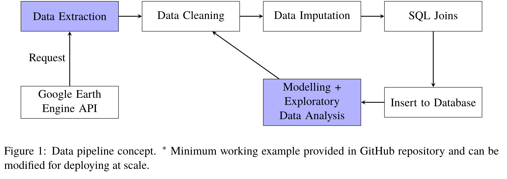

Spatiotemporal Modelling
========================

Motivation
------------

Suppose :math:`\{X_i,y_i\}_{i=1}^N` as our features and response (number of positive influenza cases). We
will assume the following underlying relationship:

.. math::

   y_i = f(x_i) + \epsilon_i,

where :math:`x_i\in\mathbb{R}^p` is the feature, :math:`\epsilon_i\sim N(0,\sigma^2)` 
and :math:`f`
is the underlying function. Since :math:`x_i` contains spatial and temporal features, 
the standard regression methods
of generalised additive models (GAMs) (Davison, 2003), gradient boosting and regression
trees (Bishop, 2006) are not adapted to this problem, and does not help us 
understand the underlying causality/correlation. In addition, pure time series
models such as Long-short term memory (LSTM) recurrent neural networks (Hochreiter et al., 1997),
SARIMA and ARMA-GARCH models (Davison, 2003) also do not take in account of the spatial
variation. On the other hand, stochastic processes such as Gaussian processes (GP) (Rasmussen et al., 2006)
or solutions to stochastic partial differential equations (SPDE) (Hairer, 2009) are
well-adapted to what we would like to accomplish.

SPDEs are the most natural approach to modelling spatiotemporal
phenomenon, by adding a driven white noise to a partial differential
equation (PDE) to obtain

.. math::

   Lu = f + \xi\circ dW,

where :math:`L` is a differential operator, :math:`f` is a function and :math:`\xi\circ dW`
is a driven white noise. However, there is limited software to provide
solutions to these SPDEs. ``R-INLA`` (Lindgren et al., 2015) is a library that uses the Bayesian
method integrated nested Laplace approximation (INLA) to construct weak
solutions to linear fractional SPDEs, but this places too much
restriction of the underlying SPDE and would result in blackbox
modelling. 

Gaussian Processes Regression
-----------------------------

In this study, we will thus use GPs as a spatiotemporal framework to
study spatiotemporal variations. We let :math:`f` have a Gaussian process prior, giving

.. math::

   f\sim GP(\mu(\cdot), k(\cdot,\cdot)),

where :math:`\mu(\cdot):= E[f(\cdot)]` and :math:`k(\cdot,\cdot):= E[f(\cdot), f(\cdot)]` are 
chosen mean and covariance functions. 
We also call :math:`k(\cdot,\cdot)` a kernel by convention. The choice of the mean is usually zero mean,
constant mean, polynomial or splines. This helps us capture the trend of :math:`y_i`. However, perhaps 
what would be more important is capturing the covariance between different features. It is 
worth mentioning that GP regression is a form of non-parametric (infinite-dimensional) regression.
Suppose we have observed some data :math:`X,y` with :math:`N` observation and we are given a 
test set :math:`X_*` with :math:`K` observations,  where we would like to predict :math:`y_*`. 
Then using the  Sherman-Morrison-Woodbury identity on the joint posterior of the GP, 
we obtain the posterior predictive distribution of :math:`f_*` (Rasmussen et al, 2006)

.. math::

    f_*| X,y,f\sim N_K(K_*(K + \sigma^2I_N)^{-1}[f + \mu], K_{**} - K_*(K + \sigma^2I_N)^{-1}K_*^T),

where the notations are :math:`f, f_*` denote the value of the function for the training and test set,
for the GP function, :math:`K, K_*,K_{**}` are the covariance matrices of the training, test-training and
test sets, and :math:`\mu` is taken to be the short hand for the mean of the training set. Finally, 
standard results from decision theory (Rasmussen et al., 2006) show that taking the loss
function as the expected square error gives the optimal prediction as 

.. math::

    E[f_*| X,y,f] = K_*(K + \sigma^2I_N)^{-1}[f + \mu].

Another way to understand Gaussian processes would be that 
we have a graphical model of :math:`p` dimensions (:math:`p` types of inputs). Below is a 
1-dimensional example visualisation of a Gaussian process random field.

.. image:: ./img/gp_field.png

The data
----------------------

Below is a spatiotemporal exploratory analysis of the number of influenza cases from the ``influenza`` dataset. 
We obtained the coordinates of the capitals of each country and performed an SQL left join of ``influenza`` on
the coordinates. We picked the coordinates of the capitals because these would usually indicate the regions with
most of the population.

To use the dragging cursor, click on the play icon and select the second icon.

We can make the following observations.

- Influenza outbreaks seems to appear in clusters of regions. Especially for Europe and Central + South America.
One of our goals could be to identity how the spread occurs over space and time.
- There are more outbreak reports in Europe and fewer in South America. This may be due to better surveying and medical
infrustructure in Europe. Another subject of study for us would be to use the existing data for 
South America to interpolate what could happen in countries where there is little or no observation, 
using a spatiotemporal model.

.. raw:: html

	<iframe src="_static/spatial_outbreak.html" height="530px" width="100%"></iframe>

Our previous visualisation and studies view that there is a yearly seasonality. Many recent studies have been 
on studying the relationship of spatiotemporal spread of influenza and diseases over a particular regional clusters. 
For example, Bhatt et al., 2017 looked at mapping disease over space-time using a GP in sub-Saharan Africa, 
Chen et al, 2019 looked at seasonal influenza spread in Shenzhen, China and Senanayake et al., 2016 on weekly flu
occurrence in the USA. 

Motivated by Bhatt et al., 2017, we use live satellite imagery to obtain aggregated remote sensing data of
temperature, precipitation, humidity etc... to augment our existing feature space. The data can be found from 
Google Earth Engine API (Gorelick et al., 2017) newly-developed by Google. An extraction pipeline is illustrated below.

Using Lasso regularised regression, we select the following features for our Gaussian process model

- Capital city latitude 
- Capital city longitude 
- Weekly temperature 
- Evapotranspiration, derived using a one-dimensional soil water balance model 
- Surface pressure
- Surface Height
- Year 
- Month

In particular, we found that spatial, temporal and the number of physicians to be highly 
significant features to the occurrence of influenza. Of course, as GPs are nonparametric models,
keeping these variables will not have a bad effect on the model fit as GPs are able to fit sufficiently
regular underlying functions (see http://www.stats.ox.ac.uk/~sejdinov/teaching/atml14/Theory_2014.pdf for a 
rigorous treatment of reproducing kernel Hilbert spaces for Gaussian processes).

Model 1: Gaussian process
-------------------------

To treat the seasonal trend, we will choose a kernel :math:`k_{\text{se}}(t', t) = ` for years :math:`t,t'`.

Model 2: Deep Kernel Learning 
-----------------------------

Suppose now that we have a latent feature extractor :math:`g:\mathbb{R}^p\rightarrow\mathbb{R}^2`, and 
:math:`f:\mathbb{R}^2\rightarrow\mathbb{R}^1` being a Gaussian process. 

Model 3: XGBoost
-----------------------------

Experimental Results
--------------------
