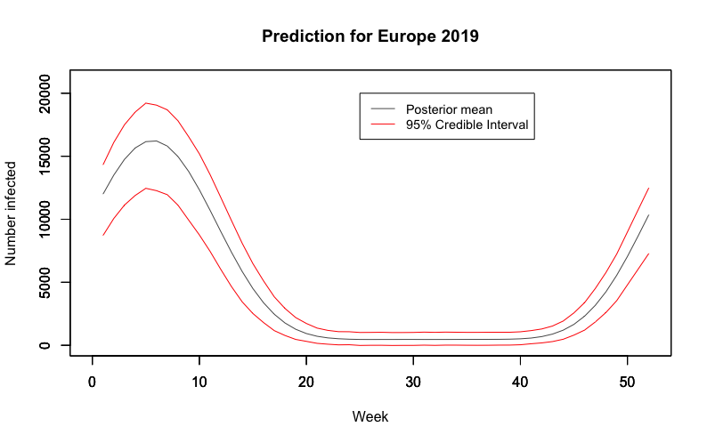

.. _bayesian:

======================
How big will an influenza outbreak be?
======================

Motivation
----------

Before we start modelling the severity of influenza seasons, we investigated the state-of-the-art for this field. As the leading national public health institute in the United States and one of the world's premier infectious disease surveillance bodies, the Centre for Disease Control (CDC) represents the status quo in influenza modelling. The CDC currently deploy an adaptation of Serfling's method [#first]_, which uses cyclic regression to model the weekly proportion of deaths from pneumonia and influenza. Adaptations to the basic model have incorporated indicators such as counts of patient visits for influenza like illness (ILI) [#second]_ [#third]_. However, regardless of modern modifications, the methodology is limited by its unfounded assumption that observations are independent and identically distributed.

**In this contribution**, we attempt to shift the methodology towards the Bayesian
framework in order to provide better epidemic thresholds that are
adjusted for seasonal effects. In doing so, we build prior and
observation models for the number of individuals infected by influenza
within a specific region. After building the models, we simulate from the
prior to test the model's performance and ensure the prior model is
sufficiently grounded in reality to produce justified posterior
inference. Once we are satisfied with the model we deploy Approximate
Bayesian Computation (ABC) to generate approximate posterior samples and
proceed to make probabilistic statements to inform policy makers.

Prior Elicitation
-----------------

We begin by outlining the prior and observation models in this setting.
Whilst the systematic use of parametrised distributions is not always
justifiable, when building the prior we arbitrarily restrict ourselves
to a parametrised density where we can make subjective evaluations of
the parameters in line with our knowledge of the world.

Prior Model
-----------

We build a model for the number of individuals infected by influenza in
a given week for a two year period. Whilst the model is agnostic to
geographical location, we focus on specifying the prior distribution in
line with European influenza cycles. The parameters are
:math:`\Theta = (X_{1:104},\mu, \theta, \alpha, \rho, \ell)`.
The notation is defined as follows: :math:`(X_{1:104}) := (X_1,\ldots,X_{104})`, where :math:`X_i` is the number of positive influenza samples recorded in week :math:`i`, and the others are parameters for the model, as defined below.
Using these parameters, we model the weekly flu process :math:`(X_i)_{i=1}^{104}` over a 2 year period (for example 2018 to 2019) as a weekly mean with an
autoregressive (AR) process. By considering the seasonality of infection
count we use a single AR process for each winter, since each winter has a number of hidden variables. For example, the strands of influenza active, health care spending, temperature and so on differ depending on the year. By only considering short time periods, we lower the risk of being affected by the change of these hidden variables.

Putting this all together, we have :math:`X_t|X_{t-1},\phi = m_t+y_t` with
:math:`y_t \stackrel{}{\sim} AR(\rho,50)` and
:math:`\phi = (\mu, \theta, \rho, \ell, \alpha)`. The mean in week
:math:`t` is given by

.. math:: m_{t} = \mu + \theta t + \alpha sin^8\Big(\frac{\pi}{52}t - \ell\pi\Big).

That is to say, the weekly mean is a baseline infection count
:math:`\mu`, with :math:`\theta t` to describe the secular trend, and a
suitably scaled and lagged sine function to capture seasonality.

The prior :math:`\pi(\Theta)` is composed of the following:

.. math::

   \begin{aligned}
   & X_{1}|\phi \stackrel{}{\sim} \mathcal{N}\Big(m_{1} ,\frac{50^2}{1-\rho^2}\Big) & & \mu \stackrel{}{\sim} \mbox{Unif}(0,1000) \\
   & X_{27}|\phi \stackrel{}{\sim} \mathcal{N}\Big(m_{1} ,\frac{50^2}{1-\rho^2}\Big) & & \theta \stackrel{}{\sim} \mbox{Unif}(0,0.5)  \\
   & X_{79}|\phi \stackrel{}{\sim} \mathcal{N}\Big(m_{1} ,\frac{50^2}{1-\rho^2}\Big) & & \rho \stackrel{}{\sim} \mbox{Unif}(0.6,0.9) \\
   & X_{t}|X_{t-1}, \phi \stackrel{}{\sim} \mathcal{N}\Big(m_{t} + \rho(X_{t-1}-m_{t-1}), 50^2\Big) & & \ell \stackrel{}{\sim} \mbox{Unif}(0.7,1) \\
   &      && \alpha \stackrel{}{\sim} \mbox{Unif}(3000,25000)\end{aligned}

for :math:`t \in \{2,...,26,28,...,78,80,...,104\}`.

Given this prior model we have the following decomposition:

.. math::

   \begin{aligned}
    \pi(\Theta)  &=  \pi(X_{1:104}|\phi)\pi(\phi) \\
    &= \pi(X_{104}|X_{1:103},\phi)\pi(X_{1:103}|\phi)\pi(\phi) \\
    &= \pi(X_{104}|X_{103},\phi)\pi(X_{1:103}|\phi)\pi(\alpha)\pi(\rho)\pi(\ell)\pi(\theta)\pi(\mu)\\
    &= \bigg[\prod_{i=2}^{26}\pi(X_{i}|X_{i-1},\phi)\bigg]\pi(X_{1}|\phi)\bigg[\prod_{i=28}^{78}\pi(X_{i}|X_{i-1},\phi)\bigg]\pi(X_{27}|\phi)\\
    &\times \bigg[\prod_{i=80}^{104}\pi(X_{i}|X_{i-1},\phi)\bigg]\pi(X_{79}|\phi)
   \pi(\alpha)\pi(\rho)\pi(\ell)\pi(\theta)\pi(\mu)\end{aligned}.

Observation Model
-----------------

We model a two year period above and make predictions for the
second year given the observations in the first. The data from the first year involves some noise due to poor data collection and miss-classification of illnesses, that is to say that the observed data :math:`Y_i` has the form

.. math::

	 Y_{1:52} = X_{1:52} + (\epsilon_i)_{i=1}^{52},

where :math:`\epsilon_{i} \stackrel{iid}{\sim} \mathcal{N}(0,1)`. Thus
we have

.. math:: \pi(X_{1:52}|\Theta) = \prod_{i=1}^{52}\mathcal{N}(Y_{i},1).

Simulating our prior model
--------------------------

As our prior model is a reductive representation of a complex random
phenomena, it is vital to evaluate the model for likeness to the
real world to ensure our posterior inference is justified.

We first consider 100,000 samples from the prior model in the below figure.
This graph demonstrates likeness to real observed data for Europe over
the past 5 years. Additionally, the credible
intervals plotted show a sufficiently large range of realisations. The
mean weekly flu count is 3934 (Credible Interval: 1313, 6629) which provides
a reasonable fit to the reality of the weekly average of 4611 patients in 2018 in Europe.

It is important to scrutinise the prior for informativeness with respect
to the quantities we are particularly interested in. In the below figure, the
approximate distribution of average and maximum counts for 100,000
samples are given. Both are satisfactory since they fall roughly
uniform across wide intervals. The weekly average of 4611 in 2018 falls
in the range of high density for the average, and the European 2018
maximum of 19,074 patients infected also sits in the high density region
of the approximate maximum. Both distributions reflect reality well and
do not over-inform.

A Quick Remark
~~~~~~~~~~~~~~

When choosing a prior it is important to consider alternatives. In this
project a range of distributions for each of the parameters
:math:`(\alpha, \rho, \ell, \mu, \theta)` were considered in order to
represent different states of knowledge. We verified that the results of
our analysis were not sensitive to this range of priors. For example in
our choice of :math:`\mu`, which provides the base-level for the weekly
mean :math:`m_{t}`, we considered variants of uniform, normal and
triangle distributions, including
:math:`\mathcal{N}(10000,3),\mbox{Unif}(3000,25000)` and
:math:`\text{Tri}(3000,25000,10000)`. We observed reasonable similarity
between the distributions and ultimately decided to work with the
uniform distribution since it best represented our prior beliefs.

Model Choice
-----------------

We are interested in understanding whether or not our current model,
:math:`\mathcal{M}_{1}`, is adequate. In doing so, we compare its
performance with alternative models whose difference with our current
model is the sine function raised to a high power. That is, for alternative models :math:`\mathcal{M}_{2}, \mathcal{M}_{3}, \mathcal{M}_{4}, \mathcal{M}_{5}` and :math:`\mathcal{M}_{6}`, we alter the weekly mean number of influenza
positive virus as:

.. math::

   \begin{aligned}
    \mathcal{M}_{2} &:  m_{t} = \mu + \theta t + \alpha \sin^{10}\Big(\frac{\pi}{52}t - \ell\pi\Big) \\
    \mathcal{M}_{3} &:  m_{t} = \mu + \theta t + \alpha \sin^{12}\Big(\frac{\pi}{52}t - \ell\pi\Big) \\
    \mathcal{M}_{4} &:  m_{t} = \mu + \theta t + \alpha \sin^{16}\Big(\frac{\pi}{52}t - \ell\pi\Big) \\
    \mathcal{M}_{5} &:  m_{t} = \mu + \theta t + \alpha \sin^{20}\Big(\frac{\pi}{52}t - \ell\pi\Big) \\
    \mathcal{M}_{6} &:  m_{t} = \mu + \theta t + \alpha \sin^{30}\Big(\frac{\pi}{52}t - \ell\pi\Big).  \end{aligned}

Note that all models considered are even powers of sine as we know the weekly mean number of influenza positive virus to be always positive.
Here a finite number of model comparisons is made. If one wants to
consider an infinite number of models a more delicate construction of
the unconditional probabilities :math:`(p_{i} : i \in \mathbb{N})` is
required (for example adhering to notions of coherence). Assuming an
equal prior weighting, we progress to consider Bayes factors.

Bayes factors depend on estimates of the marginal likelihood for the
observation in question, that is, the first year falling in line with
recorded data. We make use of the following consistent estimator:

When implemented using :math:`n=100,000` the approximation produced
unstable results despite efforts to reduce computational underflow. To
assess the evidence for accepting :math:`\mathcal{M}_{k}`,
:math:`k\neq 1`, over :math:`\mathcal{M}_{1}` we compute the Bayes
factor for the best performing of
:math:`\mathcal{M}_{2},...\mathcal{M}_{6}` against
:math:`\mathcal{M}_{1}`. In 10 runs we realised a range of
:math:`(0.004,12.656)` with the Naive approximation. However, the
particular :math:`\mathcal{M}_{k}` with the best performance was
consistently :math:`\mathcal{M}_{1}`, so we proceed with
:math:`\mathcal{M}_{1}`.

Posterior sampling
------------------

Now that we are confident with the prior model, we proceed to generate approximate
samples of the posterior distribution given observed European data.
Whilst it would be possible to generate true posterior samples, for
example by using Metropolis-Hastings and assessing the quality of fit
with ACFs, trace plots, and checking that marginal distributions agree,
we instead deploy ABC to generate approximate uncorrelated samples.

Approximate Bayesian Computation
--------------------------------

With the aim to make probabilistic statements about 2019 we deploy
approximate Bayesian computation to target the posterior. In doing so,
we generate samples from :math:`\pi(\Theta|Y_{1:52})` where
:math:`Y_{1:52}` are given in ``influenza_activity.csv``.

Below we observe the first year of some synthetic data, with samples
accepted by ABC in green. These samples provide a satisfactory fit to
the observed process.

Results
-----------------

Using the posterior distribution we can inform policy makers about the
probable magnitudes of the outbreaks, allowing
for improved emergency planning and resource allocation. This methodology
also provides an opportunity to look at the posterior for different regions of a country. Medical professionals can then
strategically allocate their resources to regions with a higher probability of outbreak.

To demonstrate its usefulness, we consider 2018 model predictions given 2017 cycle observations. While we observe the peaks to be consistently above the mean prediction, we find that the observations for 2018 consistently fell within our tight Highest Posterior Density (HPD) interval. Given that the European Centre for Disease Prevention and Control recognised 2018 as a reasonably large season, we are encouraged by the fact the observations still fell within our bounds [#forth]_.

.. image:: ../img/forecast2018.png
	:scale: 60 %

These results demonstrate our model's usefulness; with a traditional model based off Serfling's method, we could not have estimated the amount of extra resources required to manage large seasons such as this one, but our model gives a credible interval which can even account for these. We envision that policy makers could use our model to make sure that they are well prepared for large events whilst also ensuring that they do not overbudget.

Using 2018 observations for 2019 predictions, we observe an expected maximum number of viruses
testing positive for influenza at 14,487 with a 95% credible interval of
(3882,24675) in the prior. This expected maximum shifts to 19,413 in the posterior
with a 95% credible interval at (14507,20085), putting the 2019 flu season on track to be about as large if not larger than the 2018 one. Below we also produce the expected flu cycle for 2019 with 95% HPD intervals.

We also believe that this could provide an alternative epidemic threshold to that currently used by the Centre for Disease Control; if we were to find that the number of infections lies outside the HPD region, this would be an indication that we are failing to control the outbreaks and on the verge of an epidemic, and suitable measures should be taken.

Shortcomings
-----------------

Whilst we achieved success in developing a model that reframed and extended the existing approach, there are a few shortcomings to be mentioned. Firstly, it is generally difficult to assess whether arbitrary features of the prior  predominate our posterior analysis. The question of robustness has been tackled in the literature and we could extend our models by considering the prior belonging to a class of distributions as proposed by Berger’s classification [#five]_. Attempts could then be made to derive bounds on posterior quantities and hence produce analysis that is less sensitive to the choice of prior.

Beyond criticism of the arbitrariness and importance of the prior, we must also consider the use of ABC. The applications of ABC are often based on improved versions of the basic rejection scheme [#six]_, and have already yielded valuable insights into questions concerning the rate of spread of pathogens [#seven]_, [#eight]_, although we go beyond past applications that have typically focused on parameter estimation rather than posterior prediction. In our case, ABC provides the benefit of independent samples. However, true posterior samples could be found by the implementation of Hamiltonian Monte Carlo [#nine]_.

Finally, the Naive approximation of Bayes factors in this setting proved unstable. Future work could focus on deploying more stable estimators for the marginal likelihood, such as a Harmonic approximation.

.. [#first] Robert E. Serfling. (1963). Methods for Current Statistical Analysis of Excess Pneumonia-Influenza Deaths. Public Health Reports (1896-1970), 78(6), 494-506. doi:10.2307/4591848
.. [#second] L.Simenson, K. Fukuda, L. B. Schonberg, and N. J. Cox. The impact of influenza epidemics on hospitalizations. The Journal of Infectious Diseases, 181:831–837, 2000.
.. [#third] F.C. Tsui, M. M. Wagner, V. Dato, and C. C. H. Chang. Value ICD-9-Coded chief complaints for detection of epidemics. In Proceedings of the Annual AMIA Fall Symposium, 2001.
.. [#forth] https://ecdc.europa.eu/en/seasonal-influenza/season-2017-18
.. [#five] (Berger’s (1990a))
.. [#six] Beaumont, M.A. et al. (2002) Approximate Bayesian Computation in population genetics. Genetics 162, 2025–2035
.. [#seven] Tanaka, M. et al. (2006) Estimating tuberculosis transmission parameters from genotype data using approximate Bayesian computation. Genetics 173, 1511–1520
.. [#eight] Shriner, D. et al. (2006) Evolution of intrahost HIV-1 genetic diversity during chronic infection. Evolution 60, 1165–1176
.. [#nine] https://arxiv.org/abs/1701.02434

