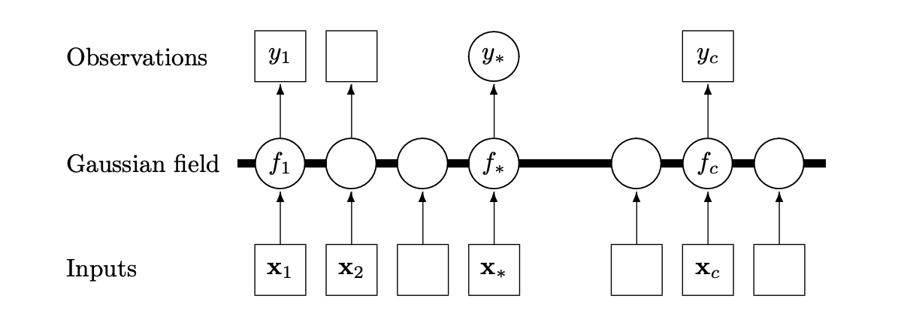
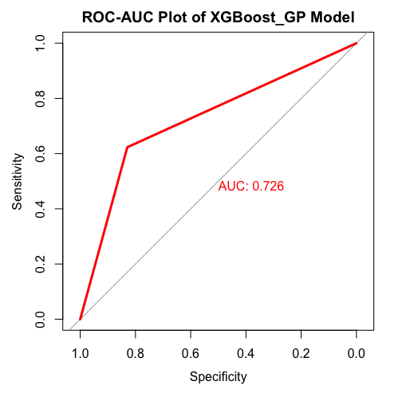

.. _gp:

When and where will influenza strike?
========================

Motivation
----------

It is of paramount importance that policy makers know ahead of time when and where influenza outbreaks will occur. Without this, it would be impossible to have optimal allocation of resources for disaster prevention and containment. We will be exploring the hypothesis that spatiotemporal and geographical factors are enough to predict influenza outbreaks. While this may seem straightforward, the study of the spatiotemporal and geographical factors and its relation to disease outbreaks is a relatively computationally expensive and novel approach that has only recently become a source of research interest [#bhatt]_ [#chen]_.

**In this section**, we explore 3 classes of models to provide a model for influenza outbreaks: Gaussian process regression, Deep Gaussian processes and a Gaussian process mixture with an XGBoost mean function. To the best of our knowledge, this third model represents a completely novel approach.

Note that while in theory these models could model everything, we focussed on the *when* and *where* of the outbreaks, not the *severity*. This is because the values for severity were found to be so varied that they were difficult to model well at the same time as modelling the location and time. Instead, we created a separate :ref:`Bayesian model <bayesian>` that specialises in predicting the severity of outbreaks.

Defining :math:`\{x_i,y_i\}_{i=1}^N` as our features and response (number of positive influenza cases) respectively, we assume the following underlying relationship:

.. math::

   y_i = f(x_i) + \epsilon_i,

where :math:`x_i\in\mathbb{R}^p` is the feature, :math:`\epsilon_i\sim N(0,\sigma^2)`
and :math:`f`
is the underlying function. Our features :math:`x_i` contain both spatial and temporal features, including latitudes, longitudes, and temperatures, as described in the `datasets section <datasets>`_. Due to this, the standard regression methods of generalised additive models (GAMs) [#davison]_, gradient boosting and regression
trees [#bishop]_ are not suited to this problem, and do not help us
understand the underlying causality/correlation. In addition, pure time series
models such as Long-short term memory (LSTM) recurrent neural networks [#hochreiter]_,
SARIMA and ARMA-GARCH models [#davison]_ are also unsuitable as they would not take the spatial variation into account. On the other hand, stochastic processes such as Gaussian processes (GP) [#rasmussen]_
or solutions to stochastic partial differential equations (SPDE) [#hairer]_ are
well adapted to what we would like to accomplish.

Influenza outbreaks often contain complicated causal relationships between many different social, geographical and political factors. SPDEs are perhaps the most natural approach to modelling spatiotemporal phenomena, adding a degree of noise to a partial differential equation (PDE). However, there are limited software packages that provide
solutions to these SPDEs. ``R-INLA`` [#lindgren]_ is a library that uses the Bayesian
method integrated nested Laplace approximation (INLA) to construct weak
solutions to linear fractional SPDEs, but this places too much
restriction on the underlying SPDE and would result in black-box
modelling.

Gaussian Processes Review
--------------------------

Due to the limitations of other, perhaps more obvious models mentioned above,  we will isntead use GPs as a spatiotemporal framework to
study spatiotemporal variations in this study. We let :math:`f` have a Gaussian process prior, giving

.. math::

   f\sim GP(\mu(\cdot), k(\cdot,\cdot)),

where :math:`\mu(\cdot):= E[f(\cdot)]` and :math:`k(\cdot,\cdot):= E[f(\cdot), f(\cdot)]` are
our chosen mean and covariance functions.
Following the convention from literature, we will be calling :math:`k(\cdot,\cdot)` a kernel. The mean is usually chosen to be either zero,
a constant value, a polynomial function, or splines. This helps us capture the trend of :math:`y_i`. However, more important than the mean is capturing the covariance between different features. It is
worth mentioning that GP regression is a form of non-parametric (infinite-dimensional) regression, making it perfect for modelling complex relations like this where the features can interact in complex, unforeseen ways.

Suppose we observe some data :math:`X,y` with :math:`N` observations and we are given a
test set :math:`X_*` with :math:`M` observations,  and we would like to predict :math:`y_*`.
Using the  Sherman-Morrison-Woodbury identity on the joint posterior of the GP,
we obtain the posterior predictive distribution of :math:`f_*` as [#rasmussen]_

.. math::

    f_*| X,y,f\sim N_M(K_*(K + \sigma^2I_N)^{-1}[f + \mu], K_{**} - K_*(K + \sigma^2I_N)^{-1}K_*^T),

where :math:`f, f_*` denote the value of the function for the training and test set, :math:`K, K_*,K_{**}` are the covariance matrices of the training, test-training and
test sets for the GP function, and :math:`\mu` is short hand for the mean of the training set.
In addition, using the expected square error as the loss function, one can derive the optimal prediction to be [#rasmussen]_

.. math::

    E[f_*| X,y,f] = K_*(K + \sigma^2I_N)^{-1}[f + \mu].

Another way to understand Gaussian processes is to think of it as a graphical model with :math:`p` dimensions (:math:`p` types of inputs). Below is a
1-dimensional example visualisation of a Gaussian process random field [#rasmussen]_.

While we will also deploy a Gaussian process classification model, we will omit the details as the theory is more complicated and requires variational inference. If we were to go through the derivation, however, we would find that the optimal predictor for a classification problem with the 0-1 loss is the Bayes' classifier.

Model 1: Gaussian process
-------------------------

To treat the seasonal effects, we choose a kernel

.. math::

    k(t', t) =  \exp\Bigg(\frac{2\sin^2(\pi||t-t'||_1 f)}{l^2} \Bigg)

for years :math:`t,t'`, where :math:`f` and :math:`l'` are the kernel frequency and length scale respectively. We encode a prior distribution
for the frequency to favour the value 1, as we believe that influenza outbreak occurs annually during winter.

Our exploratory data analysis indicated a relatively smooth trend for the weekly effects, justifying the use of a radial basis kernel. Our claim is supported by the theory of reproducing Hilbert spaces [#sej]_, since if the underlying functional relationship of the weekly effect is sufficiently regular (Holder-Sobolev of
certain exponents), then a GP will provide a good estimate. For the spatial and remote sensing features, we use Matérn covariance kernels, which has similar properties as the radial basis kernel.

Although more complicated kernels were tried, we found that the most straightforward kernel, consisting of a sum of all four kernels, was the most effective. We will use by a zero mean by default for simplicity.

Model 2: Deep Gaussian processes
--------------------------------

Suppose now that we have a latent feature extractor. We perform GP classification with variational inference to approximate the posterior and marginal likelihood, and use 3 layers of linear regressor-ReLU as the feature extractor. This forms a Deep Gaussian process with linear layers in between.

Model 3: Gaussian process mixture with XGBoost mean function
------------------------------------------------------------

To account for the extreme values that occur during outbreaks, we construct what is, to the best of our knowledge, a new type of GP mixture model by replacing the mean function with a pre-trained XGBoost regressor. Through this transfer learning procedure, we are able to provide uncertainty quantification for the previously purely black-box XGBoost model and augment the mean function of the GP with a more sophisticated feature regressor. We could also understand the replacement as encoding our prior belief of the true underlying function :math:`f`. Finally, this also allows us to understand the spatiotemporal and climatic relationship in our data.

Experimental Results
--------------------
To conduct prediction, we first learn the underlying function :math:`f` and then obtain a prediction of the number of influenza cases. It is clear from the nature of the data that outbreaks are often extreme, and therefore without extreme value or SPDE theory it unfeasible to make predictions of the peaks with Gaussian processes. However, the GP is very good at capturing the trend, and therefore we take 5% of the maximum value of the number of influenza cases for each country as the threshold for classifying an outbreak there respectively.

We conducted hyperparameter tuning and training using the PyTorch framework on the Imperial College GPU Cluster with two 31GB RAM Tesla K40c GPUs on Ubuntu 16.04.5. In particular, we made heavy use of the ``gpytorch`` [#gpy]_ library to model the GPs. We found that our newly proposed model was most suitable for policy-making purposes, as it provides accurate predictions with quantifiable uncertainties. The pure Gaussian process model was good at estimating the trend but performed poorly when looking at the magnitude. The Deep Gaussian process similarly had the same issue, which justified the use of transfer learning with the XGBoost prior function. The below figure illustrates an optimal prediction of whether there is an outbreak or not in space-time. The dataset is explained in the `datasets section <datasets.html>`_.

.. note::

    To use the dragging cursor, click on the play icon and select the second icon.

.. raw:: html

    <iframe src="../_static/xgboostgp_2018.html" height="530px" width="100%"></iframe>

`Figure source <https://public.tableau.com/profile/harrison4446#!/vizhome/gp_prediction/Sheet1?publish=yes/>`_. The Gaussian Process mixture with XGBoost mean function results in an AUC (area under curve) on the ROC(Receiver Operating Characteristic) curve of 0.762, as shown below. From a policy perspective, within reasonable bounds, the proportion of false negatives is more important, as a false positive will only strengthen the prevention of an outbreak. We find that out of 382 test points in 2018, we have a 95% credible interval of (10.2%,13.1%) on the percentage of false negatives, with the optimal prediction yielding 11.8%.

We also observe exactly what we hypothesised - the spread of influenza in space - in the above diagram. We can see that when an outbreak is observed in 1 country, it spreads very rapidly to neighbouring countries (especially visible during the transition from week 49 to 50).

Shortcomings
------------

As mentioned in the analysis, we have mainly focused on predicting the occurrence of outbreaks, rather than the exact number of cases. To predict the latter, there have been multiple recent studies on stochastic partial differential equations and INLA [#lindgren]_. Our team decided to implement a Bayesian model to do this, which is detailed in :ref:`the next section <bayesian>`.

Finally, there is also an existing framework for extreme value statistics that would be a more suitable model for predicting either the extreme events or looking at the probability of threshold exceedances. Moreover, the current remote sensing data focusses on capital cities, while a finer grain data source would improve the quality of the fit.

.. [#bhatt] Bhatt, S., Cameron, E., Flaxman, S.R., Weiss, D.J., Smith, D.L. and Gething, P.W., 2017. Improved prediction accuracy for disease risk mapping using Gaussian process stacked generalization. Journal of The Royal Society Interface, 14(134), p.20170520.

.. [#chen] Chen, S., Xu, J., Wu, Y., Wang, X., Fang, S., Cheng, J., Liu, X. 2019. Predicting temporal propagation of seasonal influenza using improved gaussian process model. Journal of Biomedical Informatics, 93, 103144. https://doi.org/https://doi.org/10.1016/j.jbi.2019.103144

.. [#davison] A.C. Davison. Statistical Models. Cambridge Series in Statistical and Probabilistic Mathematics. CambridgeUniversity Press, 2003. doi: 10.1017/CBO9780511815850.

.. [#bishop] Bishop, C.M., 2006. Pattern recognition and machine learning. Springer.

.. [#hochreiter] Hochreiter, S. and Schmidhuber, J., 1997. Long short-term memory. Neural computation, 9(8), pp.1735-1780.

.. [#rasmussen] Williams, C.K. and Rasmussen, C.E., 2006. Gaussian processes for machine learning (Vol. 2, No. 3, p. 4). Cambridge, MA: MIT Press.

.. [#hairer] Hairer, M., 2009. An introduction to stochastic PDEs. arXiv preprint arXiv:0907.4178.

.. [#lindgren] Lindgren, F. and Rue, H., 2015. Bayesian spatial modelling with R-INLA. Journal of Statistical Software, 63(19), pp.1-25.

.. [#sej] http://www.stats.ox.ac.uk/~sejdinov/teaching/atml14/Theory_2014.pdf

.. [#gpy] https://gpytorch.readthedocs.io/en/latest/index.html

